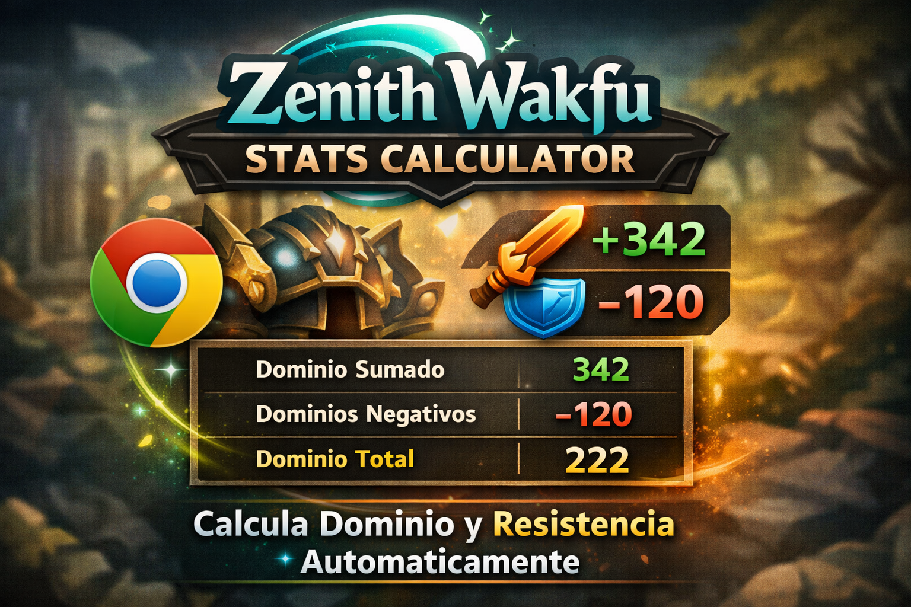
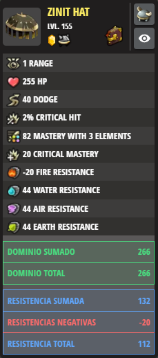

# Zenith Wakfu Stats Calculator



Extensión para Chrome que calcula automáticamente las estadísticas de **Dominio** y **Resistencia** en las tarjetas de equipamiento del [Zenith Wakfu Builder](https://www.zenithwakfu.com/builder).

## 🎯 Características

- ✅ **Suma automática de dominios positivos**: Calcula todos los dominios con multiplicadores por elementos
- ⚠️ **Detección de dominios negativos**: Identifica y suma por separado los dominios negativos
- 🔢 **Cálculo de total neto**: Muestra el total final (positivos - negativos)
- 🛡️ **Misma funcionalidad para resistencias**: Aplica la misma lógica para resistencias elementales
- ✅ Compatible con Chrome, Edge y Opera
- ✅ Completamente en español

## 📊 Cómo funciona

La extensión detecta automáticamente las estadísticas en cada tarjeta de equipamiento y:

1. **Identifica dominios especiales**:
   - "Dominio en X elementos" → multiplica por X
   - "Resistencia elemental" → multiplica por 4
   - "Resistencia en X elementos" → multiplica por X

2. **Separa valores positivos y negativos**:
   - Dominios/resistencias positivos se suman en una categoría
   - Dominios/resistencias negativos se suman en otra

3. **Muestra tablas organizadas**:
   ```
   ┌─────────────────────────────┐
   │ Dominio sumado      │  342  │
   │ Dominios negativos  │ -120  │
   │ Dominio Total       │  222  │
   └─────────────────────────────┘
   ```

## 🚀 Instalación

### Desde Chrome Web Store (Recomendado)
1. Visita la [página de la extensión en Chrome Web Store](#)
2. Haz clic en "Añadir a Chrome"
3. Confirma la instalación

### Instalación manual (Desarrollo)

### Instalación manual (Desarrollo)

1. Descarga o clona este repositorio
2. Abre Chrome y ve a `chrome://extensions/`
3. Activa el "Modo de desarrollador" (esquina superior derecha)
4. Haz clic en "Cargar extensión sin empaquetar"
5. Selecciona la carpeta de la extensión

## 💡 Uso

1. Navega a [zenithwakfu.com/builder](https://www.zenithwakfu.com/builder)
2. Explora las tarjetas de equipamiento
3. Las tablas de estadísticas aparecerán automáticamente debajo de cada equipo

No necesitas hacer nada más, ¡la extensión funciona automáticamente!

## 🖼️ Captura de ejemplo



### Reglas de Suma

#### Dominios
Se suman los siguientes valores:
- Dominio distancia
- Dominio cuerpo a cuerpo / melé
- Dominio elemental
- Dominio espalda
- Dominio crítico
- Dominio cura
- Dominio berserker
- **Dominio en X elementos**: multiplica por X
- **Dominios negativos**: se restan del total

#### Resistencias
- **Resistencia elemental**: multiplica por 4 (suma a los 4 elementos)
- **Resistencia en X elementos**: multiplica por X
- **Resistencia específica** (fuego, agua, aire, tierra): multiplica por 1
- **Resistencias negativas**: se restan del total

**Ejemplo:**
```
45 Resistencia elemental = 45 × 4 = 180
10 Resistencia fuego = 10 × 1 = 10
-5 Resistencia agua = -5 × 1 = -5
TOTAL = 185
```

## 🛠️ Tecnologías

- **Manifest V3**: Última versión del formato de extensiones de Chrome
- **Vanilla JavaScript**: Sin dependencias externas
- **Content Scripts**: Inyección de código en la página objetivo
- **CSS personalizado**: Estilos que se integran con el diseño del sitio

## 📧 Soporte y Contacto

Si encuentras algún problema o tienes sugerencias:
- **Email**: geoememsoluciones@gmail.com
- **GitHub**: [Pevalcar](https://github.com/Pevalcar)
- **Buy Me a Coffee**: [Apóyame ☕](https://buymeacoffee.com/geomemsolun)

## 📝 Changelog

### v1.0.2 (2025-12-22)
- 💰 Cambio de plataforma de donación: Ko-fi → Buy Me a Coffee (https://buymeacoffee.com/geomemsolun)
- 📝 Actualización de links de soporte en README y popup

### v1.0.1 (2025-12-22)
- 🎉 Versión inicial
- ✅ Suma automática de dominios con multiplicadores
- ✅ Suma automática de resistencias con multiplicadores
- ✅ Implementación de tablas con bordes
- ✅ Separación de valores positivos/negativos
- 🐛 Detección de números negativos
- 📊 Interfaz profesional con popup informativo
- 📧 Botones de soporte

## 📄 Archivos

- `manifest.json` - Configuración de la extensión
- `content.js` - Script principal que procesa tarjetas
- `popup.html` - Interfaz de usuario (popup)
- `popup.css` - Estilos del popup
- `popup.js` - Funcionalidad del popup
- `icon.png` - Ícono de la extensión

## 📄 Licencia

MIT License - Libre para uso personal y comercial

## 👨‍💻 Autor

Creado y desarrollado por **Pevalcar**
- GitHub: [Pevalcar](https://github.com/Pevalcar)
- Email: geoememsoluciones@gmail.com
- Buy Me a Coffee: [Apóyame ☕](https://buymeacoffee.com/geomemsolun)

## 📋 Copyright

Copyright © 2025 Pevalcar. Todos los derechos reservados.

Esta extensión es software de código abierto bajo la Licencia MIT. Puedes usar, copiar, modificar y distribuir este software libremente, siempre que incluyas el aviso de copyright original.

## 🙏 Créditos

Desarrollado para la comunidad de [Zenith Wakfu](https://www.zenithwakfu.com/)
