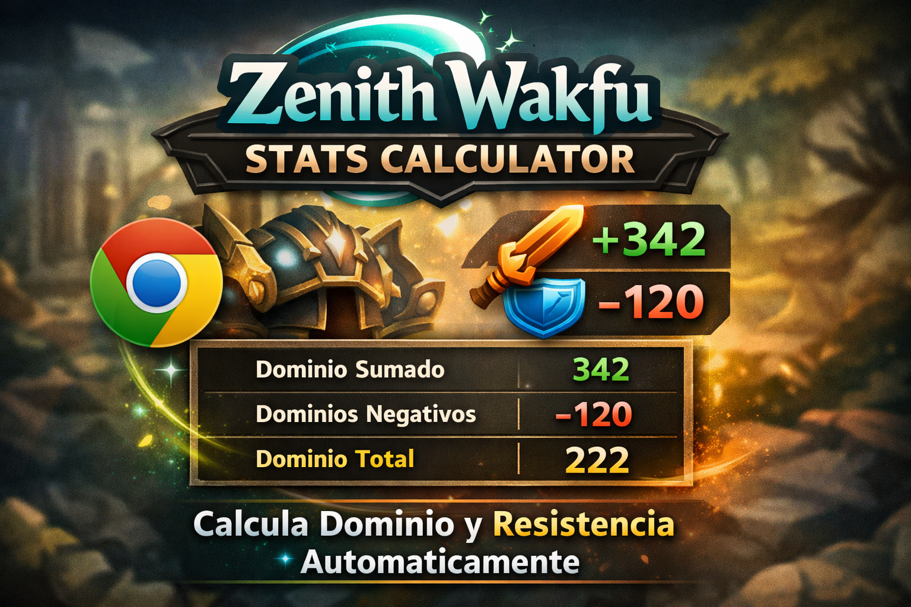

# Zenith Wakfu Stats Calculator


> Browser extension that automatically calculates Mastery and Resistance stats on equipment cards in the Zenith Wakfu Builder.
> Extensión de navegador que calcula automáticamente Dominio y Resistencia en las tarjetas de equipamiento del Zenith Wakfu Builder.
> Extension de navigateur qui calcule automatiquement les Maîtrises et Résistances sur les cartes d'équipement du Zenith Wakfu Builder.



---

## 📖 About | Acerca de | À propos

**EN** — This extension enhances the [Zenith Wakfu Builder](https://www.zenithwakfu.com/builder) by adding stat summary tables directly on each equipment card. All processing is done locally in your browser. No data is sent to any server.

**ES** — Esta extensión mejora el [Zenith Wakfu Builder](https://www.zenithwakfu.com/builder) agregando tablas de resumen de estadísticas en cada tarjeta de equipamiento. Todo el procesamiento es local en tu navegador. No se envía ningún dato a servidores externos.

**FR** — Cette extension améliore le [Zenith Wakfu Builder](https://www.zenithwakfu.com/builder) en ajoutant des tableaux récapitulatifs des statistiques directement sur chaque carte d'équipement. Tout le traitement est effectué localement dans votre navigateur. Aucune donnée n'est envoyée à un serveur.

---

## ✨ Features | Características | Fonctionnalités

| English | Español | Français |
|---|---|---|
| Auto-sum of positive masteries with per-element multipliers | Suma automática de dominios positivos con multiplicadores por elemento | Somme automatique des maîtrises positives avec multiplicateurs par élément |
| Detection of negative masteries | Detección de dominios negativos | Détection des maîtrises négatives |
| Net total calculation | Cálculo del total neto | Calcul du total net |
| Resistance calculation (elemental ×4, per-element ×N) | Cálculo de resistencias (elemental ×4, por elementos ×N) | Calcul des résistances (élémentaire ×4, par éléments ×N) |
| Multi-language support (ES / EN / FR) | Soporte multiidioma (ES / EN / FR) | Support multilingue (ES / EN / FR) |
| Real-time updates via MutationObserver | Actualización en tiempo real mediante MutationObserver | Mise à jour en temps réel via MutationObserver |
| Works on www.zenithwakfu.com and zenithwakfu.com | Funciona en www.zenithwakfu.com y zenithwakfu.com | Fonctionne sur www.zenithwakfu.com et zenithwakfu.com |

---

## 📸 Screenshots | Capturas | Captures d'écran


---

## 📦 Installation | Instalación | Installation

### Opera

**EN**
1. Download the ZIP file from the [Releases](https://github.com/Pevalcar/zenith-wakfu-stats-calculator/releases) page
2. Extract the ZIP to a folder on your computer
3. Open Opera and go to `opera://extensions`
4. Enable **Developer mode** (top-right corner)
5. Click **Load unpacked** and select the folder you extracted
6. The extension is now installed

**ES**
1. Descarga el archivo ZIP desde la página de [Releases](https://github.com/Pevalcar/zenith-wakfu-stats-calculator/releases)
2. Descomprime el ZIP en una carpeta de tu computadora
3. Abre Opera y ve a `opera://extensions`
4. Activa el **Modo de desarrollador** (esquina superior derecha)
5. Haz clic en **Cargar extensión descomprimida** y selecciona la carpeta
6. La extensión ya está instalada

**FR**
1. Téléchargez le fichier ZIP depuis la page [Releases](https://github.com/Pevalcar/zenith-wakfu-stats-calculator/releases)
2. Extrayez le ZIP dans un dossier sur votre ordinateur
3. Ouvrez Opera et allez à `opera://extensions`
4. Activez le **Mode développeur** (coin supérieur droit)
5. Cliquez sur **Charger l'extension non empaquetée** et sélectionnez le dossier
6. L'extension est maintenant installée

### Chrome / Edge

**EN** — Follow the same steps as Opera but use `chrome://extensions` or `edge://extensions` instead.

**ES** — Sigue los mismos pasos que en Opera pero usando `chrome://extensions` o `edge://extensions`.

**FR** — Suivez les mêmes étapes que pour Opera en utilisant `chrome://extensions` ou `edge://extensions`.

---

## 🎮 How to use | Cómo usar | Comment utiliser

**EN**
1. Visit [zenithwakfu.com/builder](https://www.zenithwakfu.com/builder)
2. Browse or search for equipment
3. Stat summary tables appear automatically below each equipment card showing:
   - Total positive masteries (green)
   - Total negative masteries (red, if any)
   - Net total mastery
   - Same for resistances (blue)

**ES**
1. Visita [zenithwakfu.com/builder](https://www.zenithwakfu.com/builder)
2. Navega o busca equipamiento
3. Las tablas de resumen aparecen automáticamente debajo de cada tarjeta mostrando:
   - Total de dominios positivos (verde)
   - Total de dominios negativos (rojo, si hay)
   - Total neto de dominio
   - Lo mismo para resistencias (azul)

**FR**
1. Visitez [zenithwakfu.com/builder](https://www.zenithwakfu.com/builder)
2. Parcourez ou recherchez un équipement
3. Les tableaux récapitulatifs apparaissent automatiquement sous chaque carte montrant :
   - Total des maîtrises positives (vert)
   - Total des maîtrises négatives (rouge, le cas échéant)
   - Total net des maîtrises
   - Idem pour les résistances (bleu)

---

## 📊 Stats calculation rules | Reglas de cálculo | Règles de calcul

### Mastery / Dominio / Maîtrise

| Type | Multiplier |
|---|---|
| Direct mastery (Dominio daño/distancia/cuerpo a cuerpo/espalda...) | ×1 |
| Mastery on X elements (Dominio en X elementos) | ×X |

### Resistance / Resistencia / Résistance

| Type | Multiplier |
|---|---|
| Elemental resistance (Resistencia elemental) | ×4 (applies to all elements) |
| Resistance on X elements (Resistencia en X elementos) | ×X |
| Specific resistance (fire / water / air / earth) | ×1 |

---

## 🔒 Privacy | Privacidad | Confidentialité

**EN** — This extension does NOT collect, store, or transmit any personal data. All processing is local in your browser. It only uses the `storage` permission to remember your language preference. No cookies, no tracking, no ads.

**ES** — Esta extensión NO recopila, almacena ni transmite ningún dato personal. Todo el procesamiento es local en tu navegador. Solo usa el permiso `storage` para recordar tu preferencia de idioma. Sin cookies, sin seguimiento, sin anuncios.

**FR** — Cette extension NE collecte, stocke ni transmet aucune donnée personnelle. Tout le traitement est local dans votre navigateur. Elle utilise uniquement l'autorisation `storage` pour mémoriser votre préférence linguistique. Pas de cookies, pas de suivi, pas de publicité.

Full privacy policy: [PRIVACY.md](PRIVACY.md)

---

## 📁 Project structure | Estructura | Structure

```
browser-extension/
├── manifest.json          # Extension config
├── content.js             # Content script (stat calculation)
├── popup.html             # Popup UI
├── popup.css              # Popup styles
├── popup.js               # Popup logic
├── PRIVACY.md             # Privacy policy
├── LICENSE                # MIT License
├── .gitignore
├── README.md              # This file
├── icons/                 # Extension icons
│   ├── icon-16.png
│   ├── icon-48.png
│   ├── icon-128.png
│   └── icon.png           # Source master
├── images/                # Screenshots and assets
│   ├── ejemplo.png
│   ├── presentacion.png
│   └── store/             # Store listing assets
├── scripts/               # Dev/build tools
│   ├── create-icon.ps1
│   └── prepare-assets.ps1
└── docs/                  # Internal documentation
    ├── CONTENT_SCRIPT_DOCS.md
    ├── GITHUB_SETUP.md
    ├── PUBLICACION.md
    └── rules.instructions.md
```

---

## 🛠️ Technologies | Tecnologías | Technologies

- **Manifest V3** — Latest extension format
- **Vanilla JavaScript** — No external dependencies or frameworks
- **MutationObserver** — Real-time DOM change detection
- **CSS custom properties** — Seamless integration with the site design
- **chrome.storage.sync** — Language preference persistence

---

## 📝 Changelog | Registro de cambios | Journal des modifications

### v1.0.3
- Fixed: Works on both `zenithwakfu.com` (without www.) and `www.zenithwakfu.com`
- Restructured repository layout

### v1.0.2
- Donation platform updated to Buy Me a Coffee
- Updated support links in README and popup

### v1.0.1
- Initial release
- Automatic mastery/resistance calculation with multipliers
- Negative stat detection and net total
- Multi-language support (ES / EN / FR)
- Dynamic card processing via MutationObserver

---

## 📄 License | Licencia | Licence

**EN** — This project is licensed under the MIT License. See [LICENSE](LICENSE) for details.

**ES** — Este proyecto está licenciado bajo la MIT License. Ver [LICENSE](LICENSE) para más detalles.

**FR** — Ce projet est sous licence MIT. Voir [LICENSE](LICENSE) pour plus de détails.

---

## 👨‍💻 Author | Autor | Auteur

**Pevalcar**
- GitHub: [Pevalcar](https://github.com/Pevalcar)
- Email: geoememsoluciones@gmail.com
- Buy Me a Coffee: [https://buymeacoffee.com/geomemsolun](https://buymeacoffee.com/geomemsolun)

---

## 🙏 Credits | Créditos

**EN** — Developed for the [Zenith Wakfu](https://www.zenithwakfu.com/) community.

**ES** — Desarrollado para la comunidad de [Zenith Wakfu](https://www.zenithwakfu.com/).

**FR** — Développé pour la communauté de [Zenith Wakfu](https://www.zenithwakfu.com/).

---

*Copyright © 2025 Pedro Valderrama. All rights reserved.*
